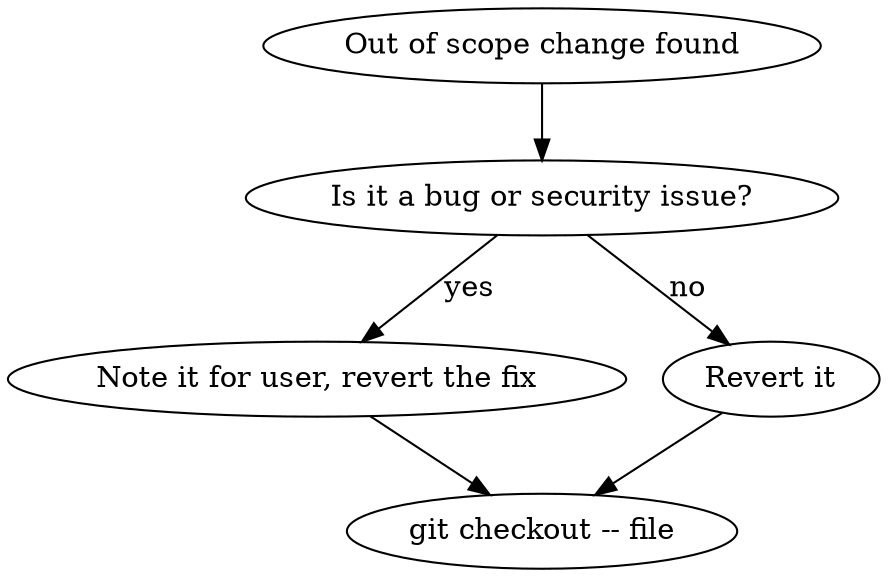

# Scope Check

## Overview

Verify that all changes in the working tree align with the original task. Scope creep is the #1 cause of overly complex PRs, unexpected regressions, and wasted review time. This skill enforces discipline: do what was asked, nothing more.

## When to Use

- Before any `git commit`
- When `git diff --stat` shows more files than expected
- When you've been coding for a while and want to verify focus
- Before creating a PR

## Process

### Step 1: Identify the Original Task

What was the user's original request? State it in one sentence:
> "The task was to: [specific request]"

### Step 2: Review All Changes

```bash
# See what files changed
git diff --stat

# See unstaged changes
git diff

# See staged changes
git diff --cached
```

### Step 3: Classify Each Change

For every modified file, categorize:

| File | Change Type | In Scope? | Justification |
|------|-------------|-----------|---------------|
| `path/to/file.js` | [what changed] | Yes/No | [why it's needed for the task] |

### Step 4: Flag Out-of-Scope Changes

Out-of-scope changes include:
- **Refactoring** unrelated code ("while I was here, I cleaned up...")
- **Adding features** not requested
- **Fixing bugs** discovered during work (note them, don't fix)
- **Adding comments/docstrings** to unchanged code
- **Reformatting** files you didn't need to touch
- **Updating dependencies** not required by the task
- **Adding error handling** for scenarios that don't apply

### Step 5: Decide and Act

For each out-of-scope change:



- **Revert**: `git checkout -- <file>` for fully out-of-scope files
- **Partial revert**: Use `git diff` to identify and manually remove out-of-scope hunks
- **Note**: Tell the user about bugs/issues found but not fixed

### Step 6: Report

Present findings to user:

```
## Scope Check: [Task Name]

**Original task**: [one sentence]
**Files changed**: [N]
**In scope**: [N]
**Out of scope**: [N] — [reverted/noted]

### Out-of-Scope Items Found
- [file]: [what was changed and why it's out of scope]
  - Action: Reverted / Noted for future

### Noted Issues (not fixed — out of scope)
- [description of bug/issue found]
- [location and suggested fix for later]
```

## Red Flags

These thoughts mean you're creeping:

| Thought | Reality |
|---------|---------|
| "While I'm here, I'll just..." | That's scope creep. Note it, move on. |
| "This is a quick improvement" | Quick improvements compound into complex PRs. |
| "This code is messy, let me clean it" | Clean it in a separate commit/branch. |
| "This will break if I don't fix it" | If it was broken before your task, it's not your fix. |
| "I should add tests for this existing code" | Only test code you're changing or adding. |
| "Better error handling here" | Only if the task requires it. |

## Common Mistakes

| Mistake | Fix |
|---------|-----|
| Fixing unrelated bugs inline | Note them, revert, create separate issue |
| Adding "defensive" code everywhere | Only add defenses the task requires |
| Reformatting untouched files | Never format files you didn't change |
| "Improving" imports/types in other files | Leave them alone unless the task requires it |
